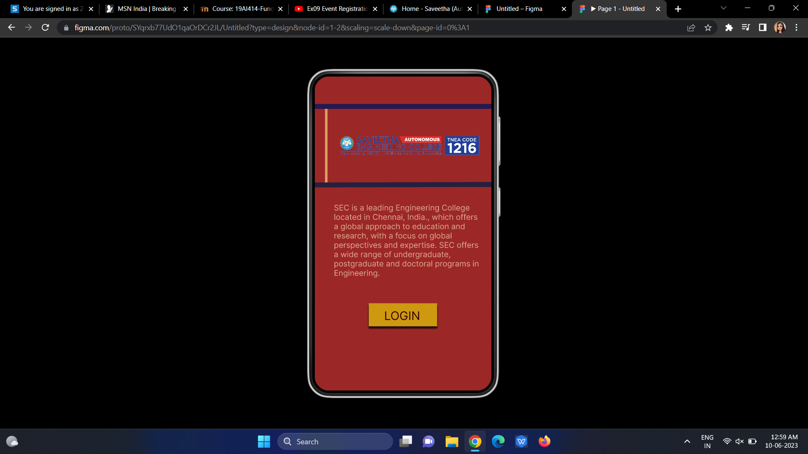
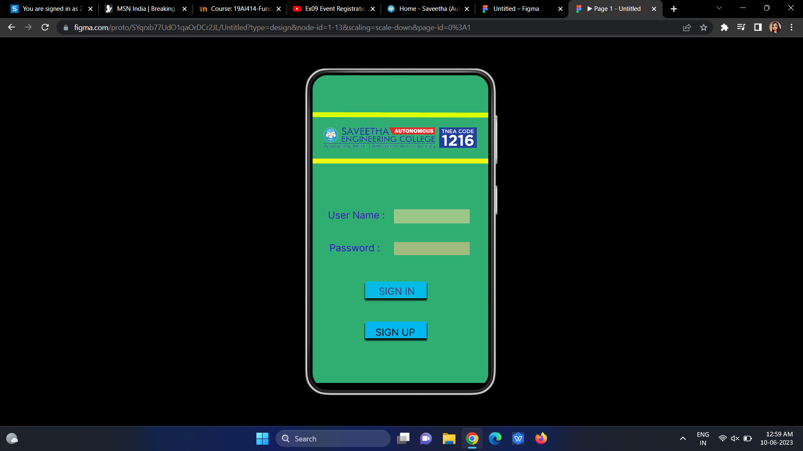
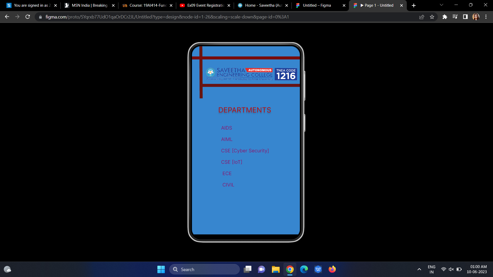

# Event Registration Web Application

## AIM:
To design, develop and deploy a web application for event registration.

## DESIGN STEPS:

### Step 1:
Create a new frame.

### Step 2:
Select any one preset size of your choice.

### Step 3:
Select the shapes you need.

### Step 4:
Import images as needed.

### Step 5:
Create pages based on your need and link them.

### Step 6:

Validate the HTML and CSS code.

### Step 6:

Publish the website in the given URL.

## DESIGN TOOL:
Figma

## CODE :
```
/* Home page */
position: relative;
width: 360px;
height: 640px;
background: #9C2727;

/* logo 1 */
position: absolute;
width: 290px;
height: 44px;
left: 48px;
top: 119px;
background: url(logo.png);

/* Line 1 */
position: absolute;
width: 360px;
height: 0px;
left: 0px;
top: 66px;
border: 10px solid #241950;

/* Line 2 */
position: absolute;
width: 360px;
height: 0px;
left: 0px;
top: 226px;
border: 10px solid #242040;
transform: rotate(-0.16deg);

/* Line 3 */
position: absolute;
width: 150px;
height: 0px;
left: 21px;
top: 66px;
border: 5px solid #DAA15E;
transform: rotate(90deg);

/* SEC is a leading Engineering College located in Chennai, India., which offers a global approach to education and research, with a focus on global perspectives and expertise. SEC offers a wide range of undergraduate, postgraduate and doctoral programs in Engineering. */
position: absolute;
width: 298px;
height: 113px;
left: 39px;
top: 258px;
font-family: 'Inter';
font-style: normal;
font-weight: 400;
font-size: 16px;
line-height: 19px;
color: #DFAB8D;

/* Rectangle 1 */
position: absolute;
width: 139px;
height: 47px;
left: 110px;
top: 462px;
background: #CE9910;
box-shadow: 0px 4px 4px rgba(0, 0, 0, 0.25), 0px 4px 4px rgba(0, 0, 0, 0.25), 0px 4px 4px rgba(0, 0, 0, 0.25), 0px 4px 4px rgba(0, 0, 0, 0.25), 0px 4px 4px rgba(0, 0, 0, 0.25), 0px 4px 4px rgba(0, 0, 0, 0.25);

/* LOGIN */
position: absolute;
width: 117px;
height: 27px;
left: 121px;
top: 473px;
font-family: 'Inter';
font-style: normal;
font-weight: 400;
font-size: 16px;
line-height: 19px;
color: #FFFFFF;

/* Login page */
position: relative;
width: 360px;
height: 631px;
background: #30AE72;

/* Line 4 */
position: absolute;
width: 360px;
height: 0px;
left: 0px;
top: 76px;
transform: rotate(-0.16deg);

/* Line 5 */
position: absolute;
width: 360px;
height: 0px;
left: 0px;
top: 86px;
border: 10px solid #DBFF00;
transform: rotate(0.16deg);

/* User Name : */
position: absolute;
width: 127px;
height: 29px;
left: 32px;
top: 275px;
font-family: 'Inter';
font-style: normal;
font-weight: 400;
font-size: 20px;
line-height: 24px;
color: #4117B8;

/* Password : */
position: absolute;
width: 113px;
height: 33px;
left: 35px;
top: 342px;
font-family: 'Inter';
font-style: normal;
font-weight: 400;
font-size: 20px;
line-height: 24px;
color: #3410C7;

/* logo 2 */
position: absolute;
width: 325px;
height: 47px;
left: 17px;
top: 105px;
background: url(logo.png);

/* Rectangle 2 */
position: absolute;
width: 155px;
height: 29px;
left: 167px;
top: 275px;
background: #9CC688;

/* Rectangle 3 */
position: absolute;
width: 155px;
height: 27px;
left: 167px;
top: 342px;
background: #A1BB81;

/* Rectangle 4 */
position: absolute;
width: 126px;
height: 34px;
left: 108px;
top: 423px;
background: #02BCE5;
box-shadow: 0px 4px 4px rgba(0, 0, 0, 0.25), 0px 4px 4px rgba(0, 0, 0, 0.25), 0px 4px 4px rgba(0, 0, 0, 0.25), 0px 4px 4px rgba(0, 0, 0, 0.25), 0px 4px 4px rgba(0, 0, 0, 0.25), 0px 4px 4px rgba(0, 0, 0, 0.25), 0px 4px 4px rgba(0, 0, 0, 0.25);

/* Rectangle 5 */
position: absolute;
width: 126px;
height: 34px;
left: 108px;
top: 505px;
background: #01B7F0;
box-shadow: 0px 4px 4px rgba(0, 0, 0, 0.25), 0px 4px 4px rgba(0, 0, 0, 0.25), 0px 4px 4px rgba(0, 0, 0, 0.25), 0px 4px 4px rgba(0, 0, 0, 0.25), 0px 4px 4px rgba(0, 0, 0, 0.25), 0px 4px 4px rgba(0, 0, 0, 0.25), 0px 4px 4px rgba(0, 0, 0, 0.25), 0px 4px 4px rgba(0, 0, 0, 0.25);

/* SIGN IN */
position: absolute;
width: 87px;
height: 20px;
left: 130px;
top: 431px;
font-family: 'Inter';
font-style: normal;
font-weight: 400;
font-size: 20px;
line-height: 24px;
color: #493A74;

/* SIGN UP */
position: absolute;
width: 88px;
height: 18px;
left: 129px;
top: 515px;
font-family: 'Inter';
font-style: normal;
font-weight: 400;
font-size: 20px;
line-height: 24px;
color: #100808;

/* SEC page */
position: relative;
width: 364px;
height: 628px;
background: #3786CF;

/* logo 3 */
position: absolute;
width: 306.68px;
height: 47.31px;
left: 46.17px;
top: 69px;
background: url(logo.png);
transform: rotate(0.21deg);

/* Line 7 */
position: absolute;
width: 174px;
height: 0px;
left: 25px;
top: 0px;
border: 10px solid #681611;
transform: rotate(89.67deg);

/* Line 8 */
position: absolute;
width: 364px;
height: 0px;
left: 0px;
top: 44px;
border: 10px solid #770C0C;

/* Line 9 */
position: absolute;
width: 336.5px;
height: 0.92px;
left: 29px;
top: 130.5px;
border: 10px solid #681414;
transform: rotate(-0.16deg);

/* DEPARTMENTS */
position: absolute;
width: 248px;
height: 32px;
left: 61px;
top: 198px;
font-family: 'Inter';
font-style: normal;
font-weight: 400;
font-size: 24px;
line-height: 29px;
color: #B70C0C;
text-shadow: 0px 4px 4px rgba(0, 0, 0, 0.25);

/* AIDS AIML CSE [Cyber Security] CSE [IoT] ECE CIVIL */
position: absolute;
width: 307px;
height: 331px;
left: 57px;
top: 255px;
font-family: 'Inter';
font-style: normal;
font-weight: 400;
font-size: 24px;
line-height: 29px;
color: #C4A976;
```

## OUTPUT:




## RESULT:
The program to design, develop and deploy a web application for event registration is completed successfully.